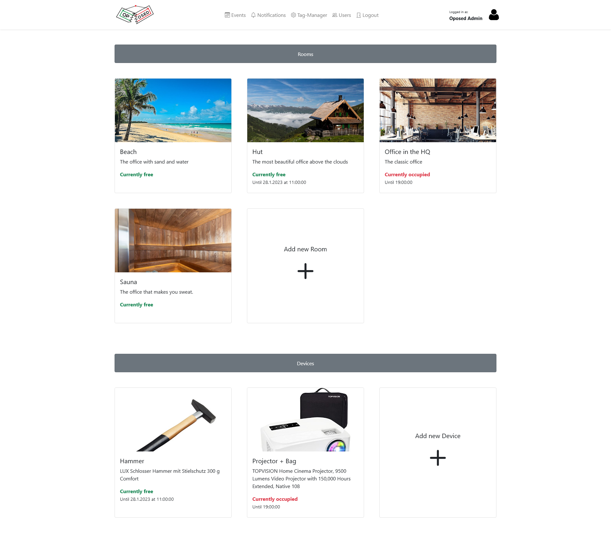

<a name="readme-top"></a>

<div align="center">
  <a href="https://github.com/Kinderschutzbund-Karlsruhe/Oposed/graphs/contributors">
    
  </a>
  <a href="https://github.com/Kinderschutzbund-Karlsruhe/Oposed/network/members">
    
  </a>
  <a href="https://github.com/Kinderschutzbund-Karlsruhe/Oposed/stargazers">
    
  </a>
  <a href="https://github.com/Kinderschutzbund-Karlsruhe/Oposed/issues">
    
  </a>
  <a href="https://github.com/Kinderschutzbund-Karlsruhe/Oposed/blob/main/LICENSE">
    
  </a>
  
  <!-- PROJECT LOGO -->
  <br />
  <br />
  <a href="https://github.com/Kinderschutzbund-Karlsruhe/Oposed">
    
  </a>

  <h3 align="center">Oposed</h3>

  <p align="center">
    A rooms and resources-schedule web tool 
    <br />
    <a href="https://github.com/Kinderschutzbund-Karlsruhe/Oposed/issues">Report Bug</a>
    ·
    <a href="https://github.com/Kinderschutzbund-Karlsruhe/Oposed/issues">Request Feature</a>
  </p>
</div>


## Table of Contents
<!-- TABLE OF CONTENTS -->
<ol>
  <li><a href="#table-of-contents">Table of Contents</a></li>
  <li>
    <a href="#about-the-project">About The Project</a>
    <ul>
      <li><a href="#screenshot">Screenshot</a></li>
      <li><a href="#built-with">Built With</a></li>
    </ul>
  </li>
  <li>
    <a href="#getting-started">Getting Started</a>
    <ul>
      <li><a href="#prerequisites">Prerequisites</a></li>
      <li><a href="#run-exampledemo">Run example/demo</a></li>
      <li><a href="#installation">Installation</a></li>
    </ul>
  </li>
  <li><a href="#usage">Usage</a></li>
  <li><a href="#contributing">Contributing</a></li>
  <li><a href="#license">License</a></li>
</ol>


<!-- ABOUT THE PROJECT -->
## About The Project

This is a selfhosting rooms and resources-schedule web tool.

It was created because most free software is no longer supported.
The alternatives usually have a very old, non-intuitive and non-responsive design.
Which makes it difficult for users to use.

This room planner was designed in collaboration with several elderly people. To be as intuitive and simple as possible.
In addition to managing rooms, it is also possible to organize resources.
For example, you need a laptop for the meeting. Which is then automatically marked as taken over this meeting-time.

In addition, there is the possibility to plan meetings publicly for other users. Which allows them to log into the meeting.
The users are informed about the offers of open meetings by an automatic newsletter. In which you can set which category of meetings you want to be informed about.

The user administration runs exclusively via an LDAP server, in which two user-groups (admins and users) can be differentiated.

<p align="right">(<a href="#readme-top">back to top</a>)</p>

## Screenshot 

</img>

<p align="right">(<a href="#readme-top">back to top</a>)</p>

### Built With

* [![C#][CSharp]][csharp-url]
* [![JavaScript][JS]][js-url]
* [![jQuery][jquery]][jquery-url]
* [![Bootstrap][Bootstrap]][bootstrap-url]


<p align="right">(<a href="#readme-top">back to top</a>)</p>


<!-- GETTING STARTED -->
## Getting Started

Just a few steps to run Oposed on your server.


### Prerequisites

You need docker and docker-compose.
<a href="https://docs.docker.com/compose/install/">More »</a>

### Run example/demo

1. Clone the repo
   ```sh
   git clone https://github.com/Kinderschutzbund-Karlsruhe/Oposed.git
   ```
2. Jump into the `example`-directory
   ```sh
   cd example/
   ```
3. Make the script runnable
   ```sh
   chmod +x start.sh
   ```
4. Run `start.sh`
   ```sh
   ./start.sh
   ```
5. Open your browser on `http://localhost:8080` and log in with one of the following access data:

| Role  | Mail            | Password     |
| ----- | --------------- | ------------ |
| Admin | admin@oposed.de | Oposed-Admin |
| User  | user1@oposed.de | oposed-user1 |
| User  | user2@oposed.de | oposed-user2 |

You can manage the users over der <a href="https://github.com/wheelybird/ldap-user-manager">LDAP-User-Manager</a> under `http://localhost:8081/log_in/`


### Installation

1. Clone the repo
   ```sh
   git clone https://github.com/Kinderschutzbund-Karlsruhe/Oposed.git
   ```
2. Open `docker-compose.yml` and setup your LDAP and SMTP-connection
   ```sh
   nano docker-compose.yml
   ```
3. Make the script runnable
   ```sh
   chmod +x start.sh
   ```
4. Run `start.sh`
   ```sh
   ./start.sh
   ```
5. Open your browser on http://localhost:80


<p align="right">(<a href="#readme-top">back to top</a>)</p>


<!-- USAGE EXAMPLES -->
## Usage


<p align="right">(<a href="#readme-top">back to top</a>)</p>


<!-- CONTRIBUTING -->
## Contributing

If you have a suggestion that would make this better, please fork the repo and create a pull request. You can also simply open an issue with the tag "enhancement".
Don't forget to give the project a star! Thanks again!

1. Fork the Project
2. Create your Feature Branch (`git checkout -b feature/AmazingFeature`)
3. Commit your Changes (`git commit -m 'Add some AmazingFeature'`)
4. Push to the Branch (`git push origin feature/AmazingFeature`)
5. Open a Pull Request

<p align="right">(<a href="#readme-top">back to top</a>)</p>


<!-- LICENSE -->
## License

Distributed under the MIT License. See `LICENSE` for more information.

<p align="right">(<a href="#readme-top">back to top</a>)</p>


<!-- MARKDOWN LINKS & IMAGES -->
<!-- https://www.markdownguide.org/basic-syntax/#reference-style-links -->
[CSharp]: https://img.shields.io/badge/c%23-%23239120.svg?style=for-the-badge&logo=c-sharp&logoColor=white
[csharp-url]: https://learn.microsoft.com/de-de/dotnet/csharp/
[JS]: https://img.shields.io/badge/javascript-%23323330.svg?style=for-the-badge&logo=javascript&logoColor=%23F7DF1E
[js-url]: https://wiki.selfhtml.org/wiki/JavaScript
[jquery]: https://img.shields.io/badge/jquery-%230769AD.svg?style=for-the-badge&logo=jquery&logoColor=white
[jquery-url]: https://jquery.com/
[Bootstrap]: https://img.shields.io/badge/bootstrap-%23563D7C.svg?style=for-the-badge&logo=bootstrap&logoColor=white
[bootstrap-url]: https://getbootstrap.com/

